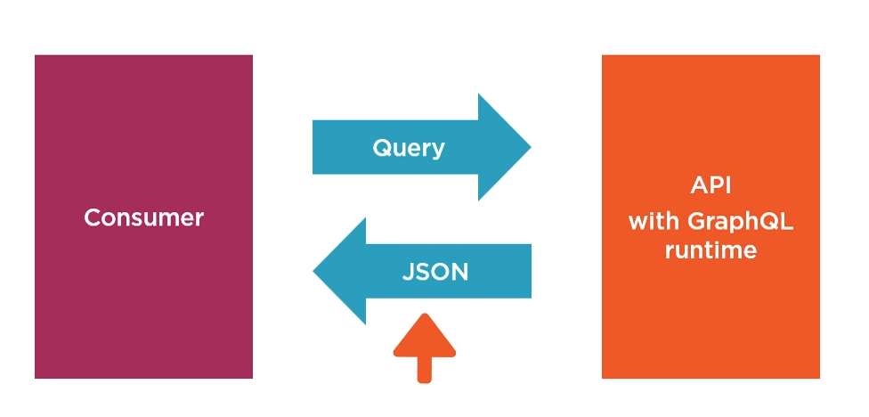
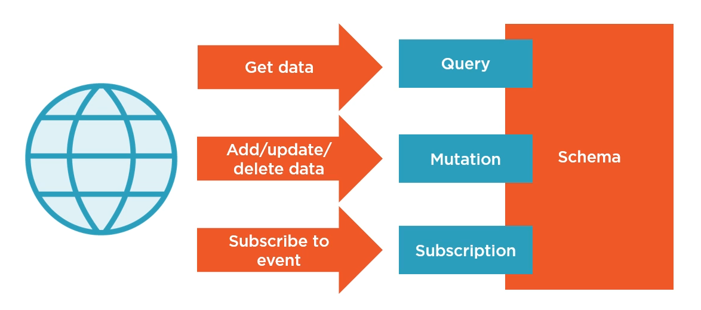
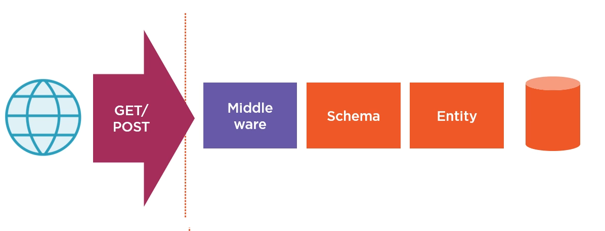

# GraphQL

# About
* [Building GraphQL APIs with ASP.NET Core](https://app.pluralsight.com/library/courses/building-graphql-apis-aspdotnet-core/table-of-contents)
* Client specifies datastructure
* Hard to HTTP caching as all resources are at the same URL
* Mutations are Add, Update, Delete
* Subscriptions are websocket notifications








## Server
1. Install GraphQL.NET, GraphQL.Server.Transports.AspNetCore, GraphQL.Server.UI.Playground, GraphQL.Server.Transports.WebSockets
2. Create Schema
```
public class ExampleSchema: Schema
{
    public ExampleSchema(IDependencyResolver resolver)
    :base(resolver)
    {
        Query = resolver.Resolve<ExampleQuery>();
        Mutation = resolver.Resolve<ExampleMutation>();
        Subscription = resolver.Resolve<ExampleSubscription>();
    }
}
```
3. Create Query
```
public class ExampleQuery : ObjectGraphType
{
    public ExampleQuery(ProductRepository productRepository)
    {
        Field<ListGraphType<ProductType>>("products",
        resolve: context => productRepository.GetAll());

        Field<ProductType>("product",
        arguments: new QueryArguments(new QueryArgument<NonNullGraphType<IdGraphType>>{Naem = "id"}),
        resolve: context => {
            context.Errors.Add(new ExecutionError("Error message"));
            var id = context.GetArgument<int>("id");
            return productRepository.GetOne(id));
        }
    }
}
```
4. Creates Query Types
```
public class ProductType : ObjectGraphType<Product>
{
    public ProductType(ProductReviewRepository reviewRepository, IDataLoaderContextAccessor dataLoaderAccessor)
    {
        Field(t => t.Id);
        Field(t => t.Name);
        Field(t => t.Description);
        Field<ProductTypeEnumType>("Type", "The type of product");

        Field<ListGraphType<ProductReviewType>>("reviews",
        resolve: context => 
        {
            var user = (ClaimsPrincipal)context.UserContext;
            var loader = dataLoaderAccessor.Context.GetOrAddCollectionBatchLoader<int, ProductReview>("GetReviewsByProductId", reviewRepository.GetForProducts);
            return loader.loadAsync(context.Source.Id);
        });
    }
}

public class ProductTypeEnumType : EnumerationGraphType<ProductTypes>
{
    public ProductTypeEnumType()
    {
       Name = "Type";
       Description = "The type of product";
    }
}
```

3. Create Mutations
```
public class ExampleMutation : ObjectGraphType
{
    public ExampleMutation(ProductReviewRepository reviewRepository, ReviewMessageService messageService)
    {
       FieldAsync<ProductReviewType>("createReview",
       arguments: new QueryArguments(new QueryArgument<NonNullGraphType<ProductReviewInputType>>{Name = "review"}),
       resolve: async context => {
           var review = context.GetArgument<ProductReview>("review");
           await reviewRepository.AddReview(review));
           messageService.AddReviewAddedMessage(review);
           return review;
       }
       )
    }
}
```

6. Creates Mutation Types
```
public class ProductReviewInputType : InputObjectGraphType
{
    public ProductReviewInputType()
    {
       Name = "reviewInput";
       Field<NonNullGraphType<StringGraphType>>("title");
       Field<StringGraphType>("review");
       Field<NonNullGraphType<IntGraphType>>("productId");
    }
}
```
7. Create Subscriptions
```
public class ExampleSubscription: ObjectGraphType
    {
        public ExampleSubscription(ReviewMessageService messageService)
        {
            Name = "Subscription";
            AddField(new EventStreamFieldType
            {
                Name = "reviewAdded",
                Type = typeof(ReviewAddedMessageType),
                Resolver = new FuncFieldResolver<ReviewAddedMessage>(c => c.Source as ReviewAddedMessage),
                Subscriber = new EventStreamResolver<ReviewAddedMessage>(c => messageService.GetMessages())
            });
        }
    }
``` 
8. Creates Subscription Types
```
    public class ReviewAddedMessageType: ObjectGraphType<ReviewAddedMessage>
    {
        public ReviewAddedMessageType()
        {
            Field(t => t.ProductId);
            Field(t => t.Title);
        }
    }
```
9. Create Message Service
```
public class ReviewAddedMessage
    {
        public int ProductId { get; set; }
        public string Title { get; set; }
    }
    
public class ReviewMessageService
    {
        private readonly ISubject<ReviewAddedMessage> _messageStream = new ReplaySubject<ReviewAddedMessage>(1);

        public ReviewAddedMessage AddReviewAddedMessage(ProductReview review)
        {
            var message = new ReviewAddedMessage
            {
                ProductId = review.ProductId,
                Title = review.Title
            };
            _messageStream.OnNext(message);
            return message;
        }

        public IObservable<ReviewAddedMessage> GetMessages()
        {
            return _messageStream.AsObservable();
        }
    }
```
10. AppStartup.cs 
```
services.AddScoped<IDependencyResolver>(s => new FuncDependencyResolver(s.GetRequiredService));

services.AddScoped<Schema>();

services.AddSingleton<ReviewMessageService>();

services.AddGraphQL(o => {o.ExposeExceptions = true; })
.AddGraphTypes(ServiceLifetime.Scoped)
.AddUserContextBuilder(httpContext => httpContext.User)
.AddDataLoader()
.AddWebSockets();
```

```
app.UseWebSockets();
app.UseGraphQLWebSockets<ExampleSchema>("/graphql");
app.UseGraphQL<ExampleSchema>();
app.UseGraphQLPlayground(new GraphQLPlaygroundOptions());
```
10. Run \ui\playground

## Server Client
1. Install GraphQL.NET
```
services.AddSingleton(t => new GraphQLClient(_config["CarvedRockApiUri"]));
services.AddSingleton<ProductGraphClient>();
```
```
 public class ProductGraphClient
    {
        private readonly GraphQLClient _client;

        public ProductGraphClient(GraphQLClient client)
        {
            _client = client;
        }

        public async Task<ProductModel> GetProduct(int id)
        {
            var query = new GraphQLRequest
            {
                Query = @" 
                query productQuery($productId: ID!)
                { product(id: $productId) 
                    { id name price rating photoFileName description stock introducedAt 
                      reviews { title review }
                    }
                }",
                Variables = new {productId = id}
            };
            var response = await _client.PostAsync(query);
            return response.GetDataFieldAs<ProductModel>("product");
        }

        public async Task AddReview(ProductReviewModel review)
        {
            var query = new GraphQLRequest
            {
                Query = @" 
                mutation($review: reviewInput!)
                {
                    createReview(review: $review)
                    {
                        id
                    }
                }",
                Variables = new { review }
            };
            var response = await _client.PostAsync(query);
            var reviewReturned = response.GetDataFieldAs<ProductReviewModel>("createReview");
        }

        public async Task SubscribeToUpdates()
        {
            var result = await _client.SendSubscribeAsync("subscription { reviewAdded { title productId } }");
            result.OnReceive += Receive;
        }

        private void Receive(GraphQLResponse resp)
        {
            var review = resp.Data["reviewAdded"];
        }
    }
```

## Javascript Client
1. Use Apollo